# Project Velure — System Architecture

> **Deep Technical Reference · v3 Production Track**

---

## Table of Contents

1. [High-Level Architecture](#high-level-architecture)
2. [Data Ingestion Layer](#data-ingestion-layer)
3. [Queuing & Buffering](#queuing--buffering)
4. [ML Inference Engine](#ml-inference-engine)
5. [Ensemble Orchestration](#ensemble-orchestration)
6. [Broadcast & API Layer](#broadcast--api-layer)
7. [Frontend Rendering Pipeline](#frontend-rendering-pipeline)
8. [Persistence Layer](#persistence-layer)
9. [Alerting Infrastructure](#alerting-infrastructure)
10. [Fault Tolerance & Resilience](#fault-tolerance--resilience)
11. [Deployment Architecture](#deployment-architecture)
12. [Performance Characteristics](#performance-characteristics)

---

## High-Level Architecture

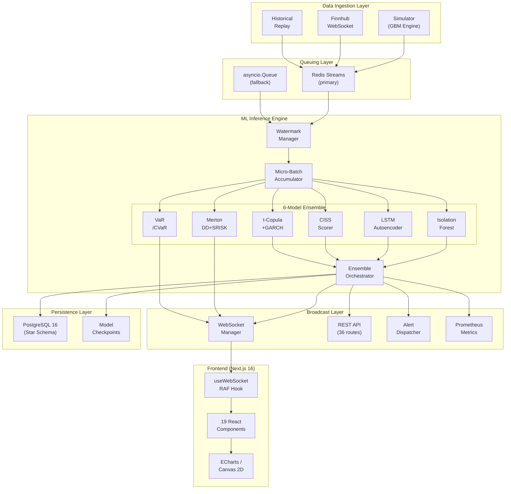
```mermaid
graph TB
    subgraph INGESTION["Data Ingestion Layer"]
        SIM["Simulator<br/>(GBM Engine)"]
        FH["Finnhub<br/>WebSocket"]
        REP["Historical<br/>Replay"]
    end

    subgraph QUEUE["Queuing Layer"]
        RS["Redis Streams<br/>(primary)"]
        AQ["asyncio.Queue<br/>(fallback)"]
    end

    subgraph INFERENCE["ML Inference Engine"]
        WM["Watermark<br/>Manager"]
        MB["Micro-Batch<br/>Accumulator"]
        subgraph MODELS["6-Model Ensemble"]
            IF["Isolation<br/>Forest"]
            LSTM["LSTM<br/>Autoencoder"]
            CISS["CISS<br/>Scorer"]
            MERTON["Merton<br/>DD+SRISK"]
            COPULA["t-Copula<br/>+GARCH"]
            VAR["VaR<br/>/CVaR"]
        end
        ENS["Ensemble<br/>Orchestrator"]
    end

    subgraph BROADCAST["Broadcast Layer"]
        WS["WebSocket<br/>Manager"]
        REST["REST API<br/>(36 routes)"]
        ALERT["Alert<br/>Dispatcher"]
        PROM["Prometheus<br/>Metrics"]
    end

    subgraph PERSIST["Persistence Layer"]
        PG["PostgreSQL 16<br/>(Star Schema)"]
        CKPT["Model<br/>Checkpoints"]
    end

    subgraph FRONTEND["Frontend (Next.js 16)"]
        HOOK["useWebSocket<br/>RAF Hook"]
        REACT["19 React<br/>Components"]
        CANVAS["ECharts /<br/>Canvas 2D"]
    end

    SIM --> RS
    FH --> RS
    REP --> RS
    RS --> WM
    AQ --> WM
    WM --> MB
    MB --> IF & LSTM & CISS & MERTON & COPULA & VAR
    IF & LSTM & CISS & COPULA --> ENS
    ENS --> WS & REST & ALERT & PROM
    MERTON --> WS
    VAR --> WS
    ENS --> PG
    ENS --> CKPT
    WS --> HOOK
    HOOK --> REACT
    REACT --> CANVAS
```

---

## Data Ingestion Layer

The ingestion layer supports four operating modes, selectable via the `DATA_MODE` environment variable. All modes produce the same normalized tick format, making the downstream pipeline mode-agnostic.

### Tick Data Schema

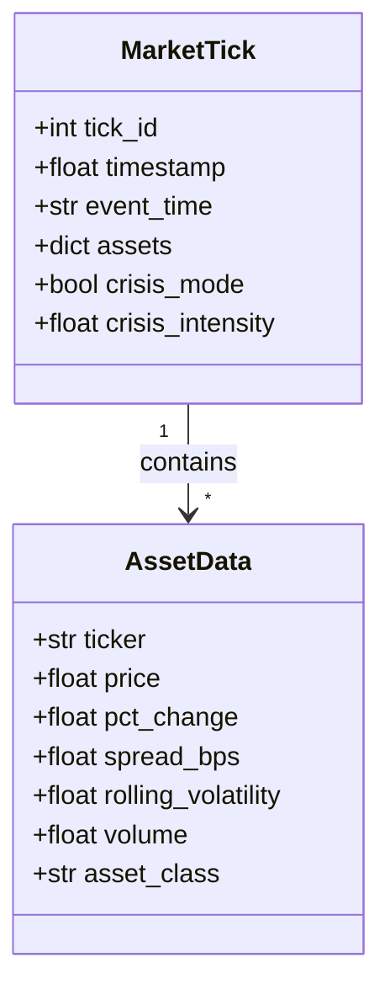
```mermaid
classDiagram
    class MarketTick {
        +int tick_id
        +float timestamp
        +str event_time
        +dict assets
        +bool crisis_mode
        +float crisis_intensity
    }
    class AssetData {
        +str ticker
        +float price
        +float pct_change
        +float spread_bps
        +float rolling_volatility
        +float volume
        +str asset_class
    }
    MarketTick "1" --> "*" AssetData : contains
```

### Simulator Engine (Default Mode)

```mermaid
flowchart LR
    subgraph GBM["Geometric Brownian Motion"]
        SEED["Initialize 18<br/>asset prices"] --> CORR["Apply Cholesky<br/>correlation matrix"]
        CORR --> DRIFT["Add drift +<br/>volatility shock"]
        DRIFT --> CRISIS{"Crisis<br/>active?"}
        CRISIS -->|No| NORMAL["µ = baseline<br/>σ = baseline"]
        CRISIS -->|Yes| SHOCK["µ = negative<br/>σ = 3-5× baseline"]
        NORMAL --> EMIT["Emit tick with<br/>18 asset updates"]
        SHOCK --> EMIT
        EMIT -->|sleep(tick_rate)| CORR
    end
```

**Key implementation details:**
- **18 assets** across 5 segments (Equities, FX, Rates, Credit, Crypto)
- **Correlated returns** via Cholesky decomposition of a pre-defined correlation matrix
- **Crisis injection** multiplies volatility by 3–5× and adds negative drift
- **Spread widening** during crisis: bid-ask spreads increase proportionally to crisis intensity

### Finnhub WebSocket (Live Mode)

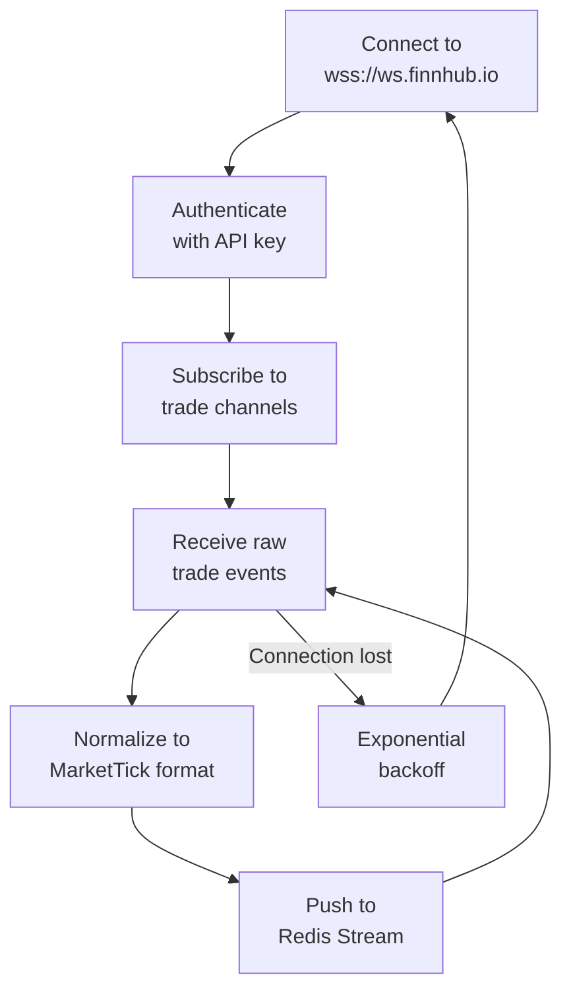
```mermaid
flowchart TB
    CONNECT["Connect to<br/>wss://ws.finnhub.io"] --> AUTH["Authenticate<br/>with API key"]
    AUTH --> SUB["Subscribe to<br/>trade channels"]
    SUB --> RECV["Receive raw<br/>trade events"]
    RECV --> NORM["Normalize to<br/>MarketTick format"]
    NORM --> QUEUE["Push to<br/>Redis Stream"]
    QUEUE --> RECV
    RECV -->|Connection lost| BACKOFF["Exponential<br/>backoff"]
    BACKOFF --> CONNECT
```

### Historical Replay Engine

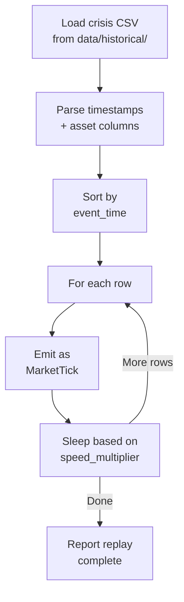
```mermaid
flowchart TB
    LOAD["Load crisis CSV<br/>from data/historical/"] --> PARSE["Parse timestamps<br/>+ asset columns"]
    PARSE --> SORT["Sort by<br/>event_time"]
    SORT --> LOOP["For each row"]
    LOOP --> EMIT["Emit as<br/>MarketTick"]
    EMIT --> DELAY["Sleep based on<br/>speed_multiplier"]
    DELAY -->|More rows| LOOP
    DELAY -->|Done| REPORT["Report replay<br/>complete"]
```

**Available crisis datasets:**
| Crisis | Date Range | Ticks |
|--------|-----------|-------|
| Lehman Collapse 2008 | Sep 10–20 | ~50K |
| Flash Crash 2010 | May 5–7 | ~30K |
| EU Sovereign Debt 2011 | Aug 4–12 | ~45K |
| China Black Monday 2015 | Aug 21–28 | ~40K |
| Volmageddon 2018 | Feb 2–9 | ~35K |
| COVID Crash 2020 | Mar 5–15 | ~55K |
| SVB Bank Run 2023 | Mar 8–14 | ~35K |

---

## Queuing & Buffering

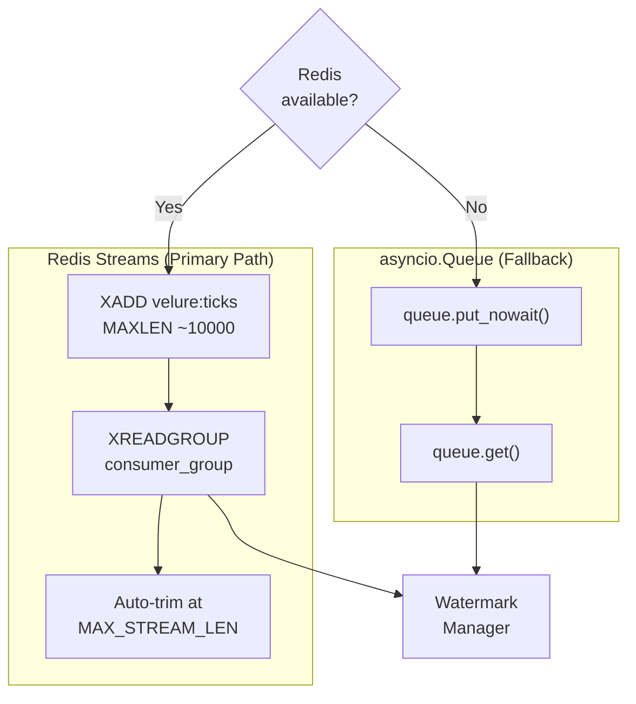
```mermaid
flowchart TB
    subgraph PRIMARY["Redis Streams (Primary Path)"]
        XADD["XADD velure:ticks<br/>MAXLEN ~10000"]
        XREAD["XREADGROUP<br/>consumer_group"]
        TRIM["Auto-trim at<br/>MAX_STREAM_LEN"]
        XADD --> XREAD
        XREAD --> TRIM
    end

    subgraph FALLBACK["asyncio.Queue (Fallback)"]
        PUT["queue.put_nowait()"]
        GET["queue.get()"]
        PUT --> GET
    end

    CHECK{"Redis<br/>available?"}
    CHECK -->|Yes| XADD
    CHECK -->|No| PUT

    XREAD --> WATERMARK["Watermark<br/>Manager"]
    GET --> WATERMARK
```

### Redis Streams Configuration

| Parameter | Default | Purpose |
|-----------|---------|---------|
| `MAX_STREAM_LEN` | 10,000 | Auto-trim to prevent unbounded memory |
| `CONSUMER_GROUP` | `velure-pipeline` | Consumer group for reliable delivery |
| `BLOCK_MS` | 100 | Max wait time for XREADGROUP |

### Fallback Mechanism

When Redis is unavailable (connection timeout, not installed), the system automatically falls back to an in-process `asyncio.Queue`. The fallback is transparent — all downstream components receive ticks through the same interface. This is logged as:
```
[REDIS] Connection failed, using in-process queue fallback
```

---

## ML Inference Engine

### Event-Time Watermarking

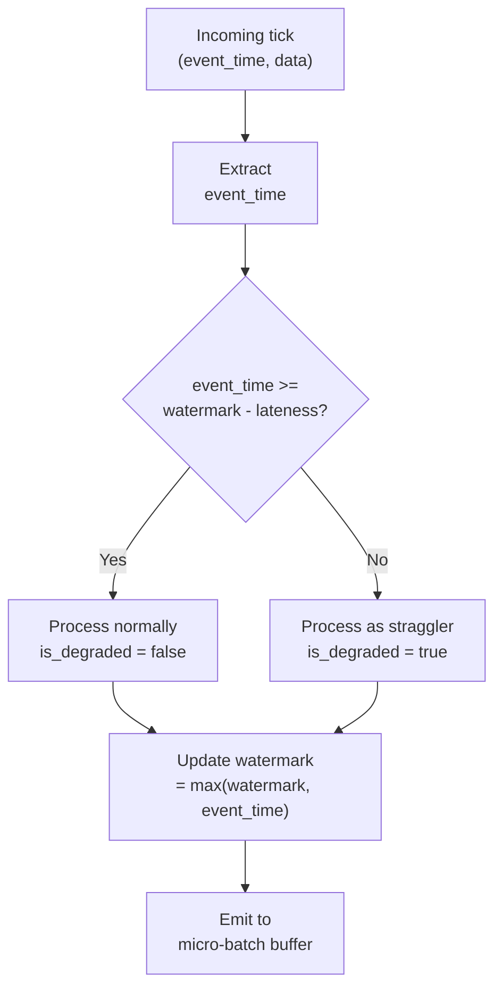
```mermaid
flowchart TB
    TICK["Incoming tick<br/>(event_time, data)"] --> EXTRACT["Extract<br/>event_time"]
    EXTRACT --> COMPARE{"event_time >=<br/>watermark - lateness?"}
    COMPARE -->|Yes| PROCESS["Process normally<br/>is_degraded = false"]
    COMPARE -->|No| LATE["Process as straggler<br/>is_degraded = true"]
    PROCESS --> UPDATE["Update watermark<br/>= max(watermark, event_time)"]
    LATE --> UPDATE
    UPDATE --> EMIT["Emit to<br/>micro-batch buffer"]
```

**Configuration:**
- `WATERMARK_LATENESS_MS = 300` — ticks arriving more than 300ms late are flagged as degraded
- Degraded ticks are still processed but downstream consumers can filter/weight them accordingly

### Micro-Batch Accumulator

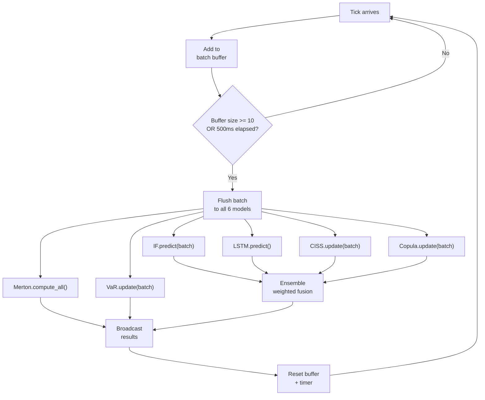
```mermaid
flowchart TB
    TICK["Tick arrives"] --> BUFFER["Add to<br/>batch buffer"]
    BUFFER --> CHECK{"Buffer size >= 10<br/>OR 500ms elapsed?"}
    CHECK -->|No| TICK
    CHECK -->|Yes| FLUSH["Flush batch<br/>to all 6 models"]
    FLUSH --> IF_PRED["IF.predict(batch)"]
    FLUSH --> LSTM_PRED["LSTM.predict()"]
    FLUSH --> CISS_PRED["CISS.update(batch)"]
    FLUSH --> MERTON_PRED["Merton.compute_all()"]
    FLUSH --> COPULA_PRED["Copula.update(batch)"]
    FLUSH --> VAR_PRED["VaR.update(batch)"]
    IF_PRED & LSTM_PRED & CISS_PRED & COPULA_PRED --> ENSEMBLE["Ensemble<br/>weighted fusion"]
    MERTON_PRED --> BROADCAST["Broadcast<br/>results"]
    VAR_PRED --> BROADCAST
    ENSEMBLE --> BROADCAST
    BROADCAST --> RESET["Reset buffer<br/>+ timer"]
    RESET --> TICK
```

**Why micro-batching?**
| Approach | Latency | Throughput | Stability |
|----------|---------|-----------|-----------|
| Per-tick inference | ~50ms | 20 tps max | ❌ CPU thrash |
| Large batch (1000) | ~5s | Unlimited | ❌ Too slow |
| **Micro-batch (10/500ms)** | **~100ms** | **100+ tps** | **✅ Stable** |

### Model Inference Flow


```mermaid
flowchart LR
    subgraph IF_FLOW["Isolation Forest"]
        IF_IN["72-dim state<br/>vector"] --> IF_SCALE["StandardScaler<br/>transform"]
        IF_SCALE --> IF_TREE["200 trees<br/>decision_function"]
        IF_TREE --> IF_SIG["Sigmoid<br/>normalization"]
        IF_SIG --> IF_OUT["score ∈ [0,1]"]
    end

    subgraph LSTM_FLOW["LSTM Autoencoder"]
        LSTM_BUF["60-tick<br/>buffer"] --> LSTM_TENSOR["Float32<br/>tensor"]
        LSTM_TENSOR --> LSTM_ENC["Encoder<br/>72→64→32"]
        LSTM_ENC --> LSTM_DEC["Decoder<br/>32→64→72"]
        LSTM_DEC --> LSTM_MSE["MSE vs<br/>input"]
        LSTM_MSE --> LSTM_ADAPT["Adaptive<br/>95th pctile"]
        LSTM_ADAPT --> LSTM_OUT["score ∈ [0,1]"]
    end

    subgraph CISS_FLOW["CISS Scorer"]
        CISS_SEG["5 segment<br/>stress values"] --> CISS_CDF["Empirical<br/>CDF transform"]
        CISS_CDF --> CISS_CORR["Cross-correlation<br/>matrix C"]
        CISS_CORR --> CISS_QUAD["Quadratic form<br/>√(z'Cz)/√n"]
        CISS_QUAD --> CISS_OUT["score ∈ [0,1]"]
    end

    subgraph COPULA_FLOW["t-Copula + GARCH"]
        COP_RET["Per-segment<br/>returns"] --> COP_GARCH["GARCH(1,1)<br/>filter"]
        COP_GARCH --> COP_RES["Standardized<br/>residuals"]
        COP_RES --> COP_FIT["t-copula fit<br/>(ν, Σ)"]
        COP_FIT --> COP_TAIL["Tail dependence<br/>λ_L matrix"]
        COP_TAIL --> COP_OUT["avg λ_L ∈ [0,1]"]
    end
```

### GARCH(1,1) Filter Detail

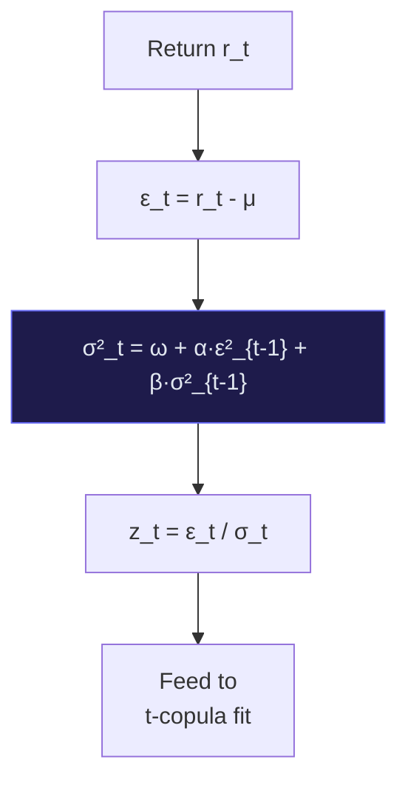
```mermaid
flowchart TB
    RET["Return r_t"] --> RESID["ε_t = r_t - μ"]
    RESID --> SIGMA["σ²_t = ω + α·ε²_{t-1} + β·σ²_{t-1}"]
    SIGMA --> STANDARD["z_t = ε_t / σ_t"]
    STANDARD --> COPULA["Feed to<br/>t-copula fit"]

    style SIGMA fill:#1e1b4b,stroke:#6366f1,color:#e2e8f0
```

**Parameters:** `ω = 0.00001, α = 0.06, β = 0.93` (persistence α+β = 0.99)

### Merton DD Computation Flow

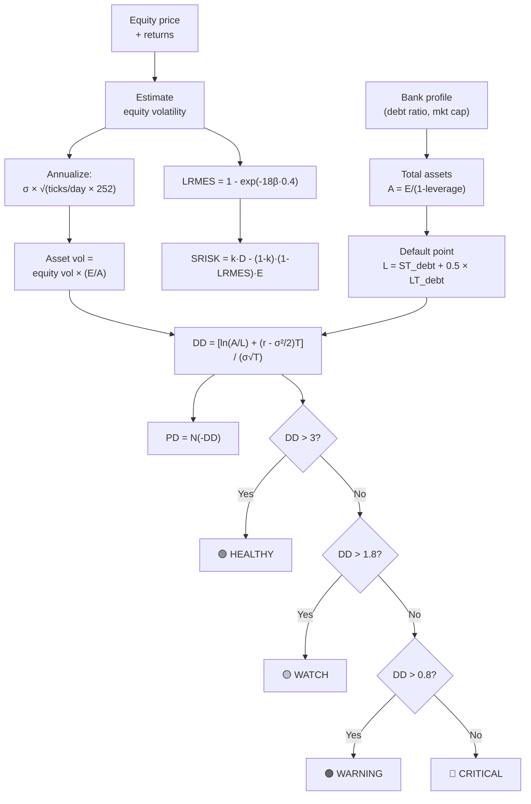
```mermaid
flowchart TB
    PRICE["Equity price<br/>+ returns"] --> VOL["Estimate<br/>equity volatility"]
    VOL --> ANNUALIZE["Annualize:<br/>σ × √(ticks/day × 252)"]
    ANNUALIZE --> ASSET_VOL["Asset vol =<br/>equity vol × (E/A)"]

    PROFILE["Bank profile<br/>(debt ratio, mkt cap)"] --> ASSETS["Total assets<br/>A = E/(1-leverage)"]
    ASSETS --> DEFAULT_PT["Default point<br/>L = ST_debt + 0.5 × LT_debt"]

    ASSET_VOL --> DD["DD = [ln(A/L) + (r - σ²/2)T]<br/>/ (σ√T)"]
    DEFAULT_PT --> DD
    DD --> PD["PD = N(-DD)"]

    VOL --> LRMES["LRMES = 1 - exp(-18β·0.4)"]
    LRMES --> SRISK["SRISK = k·D - (1-k)·(1-LRMES)·E"]

    DD --> CLASSIFY{"DD > 3?"}
    CLASSIFY -->|Yes| HEALTHY["🟢 HEALTHY"]
    CLASSIFY -->|No| CHECK2{"DD > 1.8?"}
    CHECK2 -->|Yes| WATCH["🟡 WATCH"]
    CHECK2 -->|No| CHECK3{"DD > 0.8?"}
    CHECK3 -->|Yes| WARNING["🟠 WARNING"]
    CHECK3 -->|No| CRITICAL["🔴 CRITICAL"]
```

---

## Ensemble Orchestration

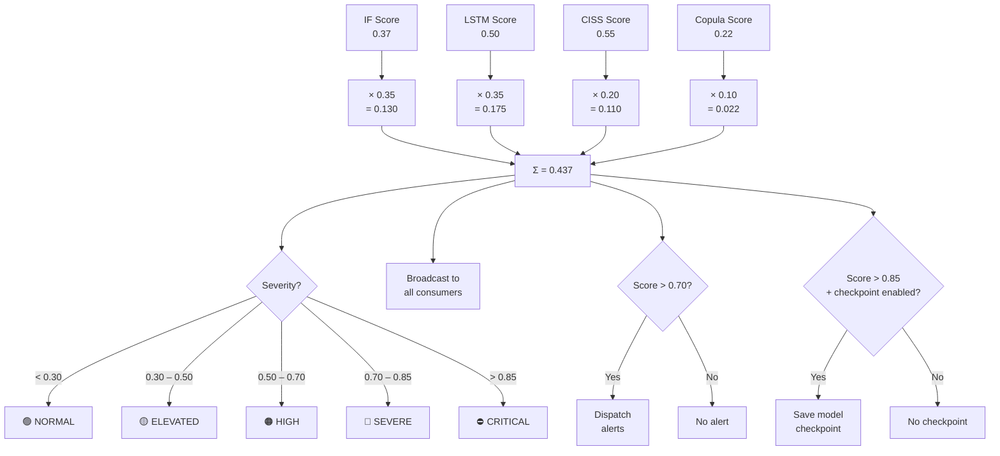
```mermaid
flowchart TB
    IF_SCORE["IF Score<br/>0.37"] --> WEIGHT_IF["× 0.35<br/>= 0.130"]
    LSTM_SCORE["LSTM Score<br/>0.50"] --> WEIGHT_LSTM["× 0.35<br/>= 0.175"]
    CISS_SCORE["CISS Score<br/>0.55"] --> WEIGHT_CISS["× 0.20<br/>= 0.110"]
    COP_SCORE["Copula Score<br/>0.22"] --> WEIGHT_COP["× 0.10<br/>= 0.022"]

    WEIGHT_IF & WEIGHT_LSTM & WEIGHT_CISS & WEIGHT_COP --> SUM["Σ = 0.437"]
    SUM --> SEVERITY{"Severity?"}
    SEVERITY -->|"< 0.30"| NORMAL["🟢 NORMAL"]
    SEVERITY -->|"0.30 – 0.50"| ELEVATED["🟡 ELEVATED"]
    SEVERITY -->|"0.50 – 0.70"| HIGH["🟠 HIGH"]
    SEVERITY -->|"0.70 – 0.85"| SEVERE["🔴 SEVERE"]
    SEVERITY -->|"> 0.85"| CRIT["⛔ CRITICAL"]

    SUM --> BROADCAST["Broadcast to<br/>all consumers"]
    SUM --> ALERT_CHECK{"Score > 0.70?"}
    ALERT_CHECK -->|Yes| DISPATCH["Dispatch<br/>alerts"]
    ALERT_CHECK -->|No| SKIP["No alert"]

    SUM --> CKPT_CHECK{"Score > 0.85<br/>+ checkpoint enabled?"}
    CKPT_CHECK -->|Yes| SAVE["Save model<br/>checkpoint"]
    CKPT_CHECK -->|No| SKIP2["No checkpoint"]
```

---

## Broadcast & API Layer

### WebSocket Broadcasting

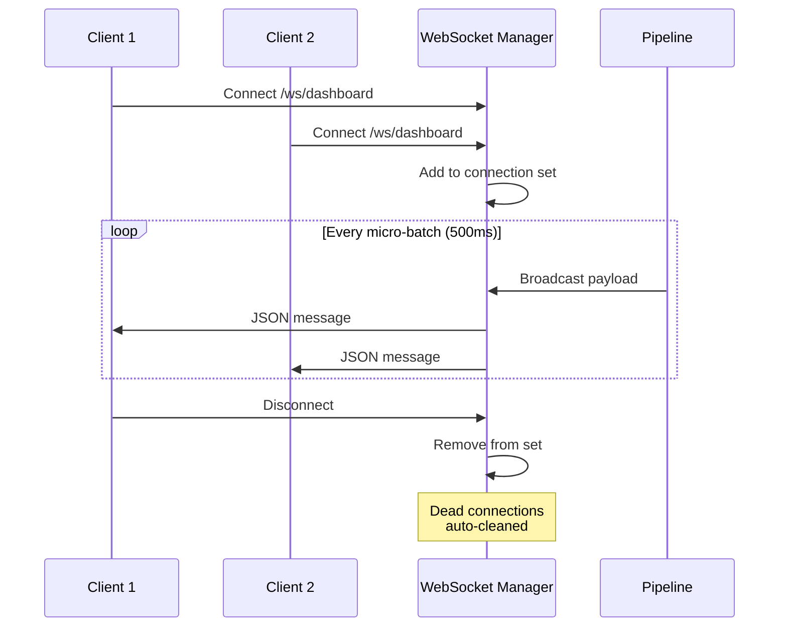
```mermaid
sequenceDiagram
    participant C1 as Client 1
    participant C2 as Client 2
    participant WS as WebSocket Manager
    participant PIPE as Pipeline

    C1->>WS: Connect /ws/dashboard
    C2->>WS: Connect /ws/dashboard
    WS->>WS: Add to connection set

    loop Every micro-batch (500ms)
        PIPE->>WS: Broadcast payload
        WS->>C1: JSON message
        WS->>C2: JSON message
    end

    C1->>WS: Disconnect
    WS->>WS: Remove from set
    Note over WS: Dead connections<br/>auto-cleaned
```

### WebSocket Payload Structure

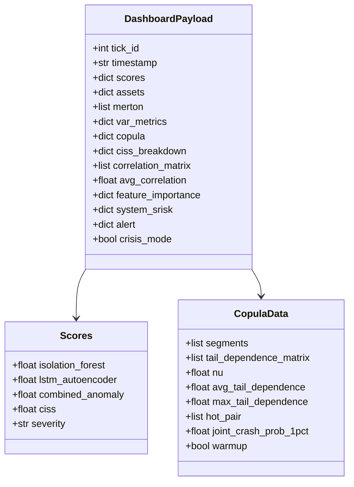
```mermaid
classDiagram
    class DashboardPayload {
        +int tick_id
        +str timestamp
        +dict scores
        +dict assets
        +list merton
        +dict var_metrics
        +dict copula
        +dict ciss_breakdown
        +list correlation_matrix
        +float avg_correlation
        +dict feature_importance
        +dict system_srisk
        +dict alert
        +bool crisis_mode
    }
    class Scores {
        +float isolation_forest
        +float lstm_autoencoder
        +float combined_anomaly
        +float ciss
        +str severity
    }
    class CopulaData {
        +list segments
        +list tail_dependence_matrix
        +float nu
        +float avg_tail_dependence
        +float max_tail_dependence
        +list hot_pair
        +float joint_crash_prob_1pct
        +bool warmup
    }
    DashboardPayload --> Scores
    DashboardPayload --> CopulaData
```

### REST API Architecture

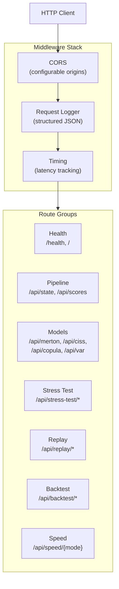
```mermaid
flowchart TB
    subgraph MIDDLEWARE["Middleware Stack"]
        CORS["CORS<br/>(configurable origins)"]
        LOG["Request Logger<br/>(structured JSON)"]
        TIME["Timing<br/>(latency tracking)"]
    end

    subgraph ROUTES["Route Groups"]
        HEALTH["Health<br/>/health, /"]
        PIPELINE["Pipeline<br/>/api/state, /api/scores"]
        MODELS["Models<br/>/api/merton, /api/ciss,<br/>/api/copula, /api/var"]
        STRESS["Stress Test<br/>/api/stress-test/*"]
        REPLAY_R["Replay<br/>/api/replay/*"]
        BACKTEST["Backtest<br/>/api/backtest/*"]
        SPEED["Speed<br/>/api/speed/{mode}"]
    end

    CLIENT["HTTP Client"] --> CORS --> LOG --> TIME --> ROUTES
```

---

## Frontend Rendering Pipeline

### Data Flow: WebSocket → Pixels

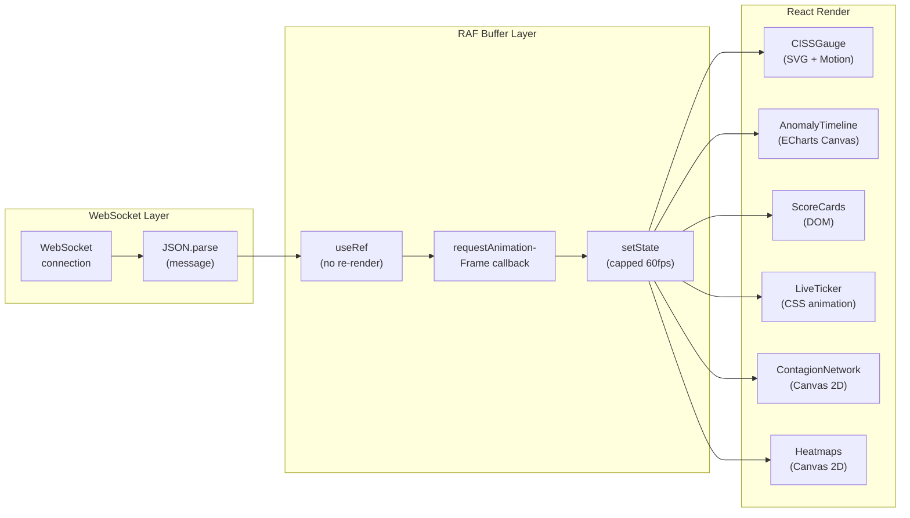
```mermaid
flowchart LR
    subgraph WS_LAYER["WebSocket Layer"]
        SOCK["WebSocket<br/>connection"] --> PARSE["JSON.parse<br/>(message)"]
    end

    subgraph BUFFER["RAF Buffer Layer"]
        PARSE --> REF["useRef<br/>(no re-render)"]
        REF --> RAF["requestAnimation-<br/>Frame callback"]
        RAF --> STATE["setState<br/>(capped 60fps)"]
    end

    subgraph RENDER["React Render"]
        STATE --> GAUGE["CISSGauge<br/>(SVG + Motion)"]
        STATE --> CHART["AnomalyTimeline<br/>(ECharts Canvas)"]
        STATE --> CARDS["ScoreCards<br/>(DOM)"]
        STATE --> TICKER["LiveTicker<br/>(CSS animation)"]
        STATE --> NETWORK["ContagionNetwork<br/>(Canvas 2D)"]
        STATE --> HEATMAP["Heatmaps<br/>(Canvas 2D)"]
    end
```

**Why RAF buffering?**

At 25 Hz (turbo mode), raw WebSocket messages arrive every 40ms. Without buffering, React would re-render 25 times per second, causing janky animation and dropped frames. The RAF buffer absorbs all messages between frames and only triggers one setState per animation frame (60fps max), keeping the UI silky smooth.

### Component Rendering Strategy

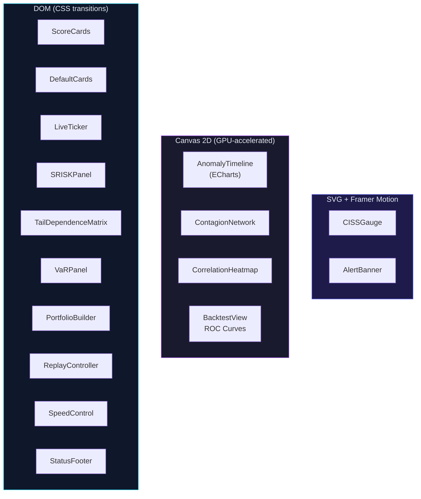
```mermaid
flowchart TB
    subgraph SVG_RENDER["SVG + Framer Motion"]
        GAUGE_C["CISSGauge"]
        ALERT_C["AlertBanner"]
    end

    subgraph CANVAS_RENDER["Canvas 2D (GPU-accelerated)"]
        CHART_C["AnomalyTimeline<br/>(ECharts)"]
        NETWORK_C["ContagionNetwork"]
        CORR_C["CorrelationHeatmap"]
        ROC_C["BacktestView<br/>ROC Curves"]
    end

    subgraph DOM_RENDER["DOM (CSS transitions)"]
        CARDS_C["ScoreCards"]
        MERTON_C["DefaultCards"]
        TICKER_C["LiveTicker"]
        SRISK_C["SRISKPanel"]
        TAIL_C["TailDependenceMatrix"]
        VAR_C["VaRPanel"]
        PORT_C["PortfolioBuilder"]
        REPLAY_C["ReplayController"]
        SPEED_C["SpeedControl"]
        FOOTER_C["StatusFooter"]
    end

    style SVG_RENDER fill:#1e1b4b,stroke:#6366f1,color:#e2e8f0
    style CANVAS_RENDER fill:#1a1a2e,stroke:#a855f7,color:#e2e8f0
    style DOM_RENDER fill:#0f172a,stroke:#06b6d4,color:#e2e8f0
```

---

## Persistence Layer

### Star Schema (Kimball Methodology)

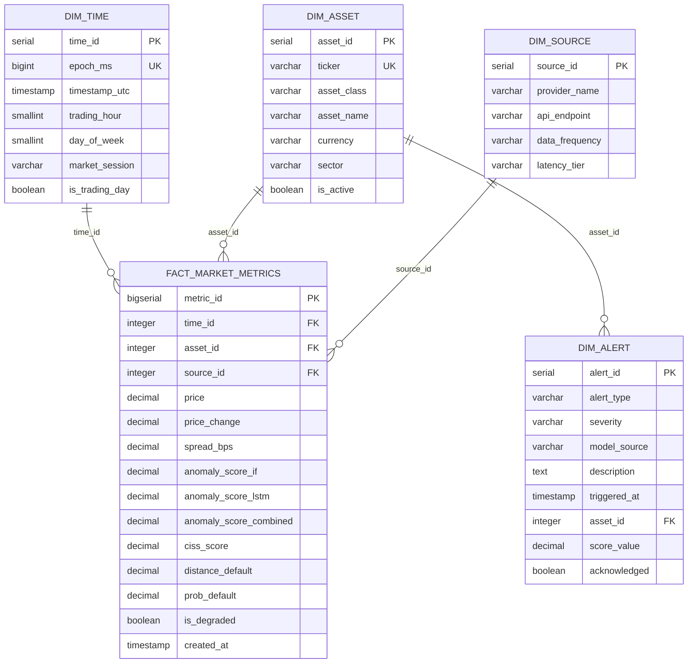
```mermaid
erDiagram
    DIM_TIME ||--o{ FACT_MARKET_METRICS : "time_id"
    DIM_ASSET ||--o{ FACT_MARKET_METRICS : "asset_id"
    DIM_SOURCE ||--o{ FACT_MARKET_METRICS : "source_id"
    DIM_ASSET ||--o{ DIM_ALERT : "asset_id"

    DIM_TIME {
        serial time_id PK
        bigint epoch_ms UK
        timestamp timestamp_utc
        smallint trading_hour
        smallint day_of_week
        varchar market_session
        boolean is_trading_day
    }

    DIM_ASSET {
        serial asset_id PK
        varchar ticker UK
        varchar asset_class
        varchar asset_name
        varchar currency
        varchar sector
        boolean is_active
    }

    DIM_SOURCE {
        serial source_id PK
        varchar provider_name
        varchar api_endpoint
        varchar data_frequency
        varchar latency_tier
    }

    FACT_MARKET_METRICS {
        bigserial metric_id PK
        integer time_id FK
        integer asset_id FK
        integer source_id FK
        decimal price
        decimal price_change
        decimal spread_bps
        decimal anomaly_score_if
        decimal anomaly_score_lstm
        decimal anomaly_score_combined
        decimal ciss_score
        decimal distance_default
        decimal prob_default
        boolean is_degraded
        timestamp created_at
    }

    DIM_ALERT {
        serial alert_id PK
        varchar alert_type
        varchar severity
        varchar model_source
        text description
        timestamp triggered_at
        integer asset_id FK
        decimal score_value
        boolean acknowledged
    }
```

### Model Checkpoint Architecture

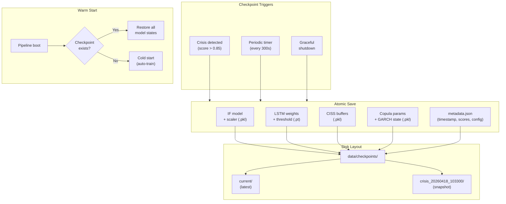
```mermaid
flowchart TB
    subgraph TRIGGERS["Checkpoint Triggers"]
        CRISIS_T["Crisis detected<br/>(score > 0.85)"]
        PERIODIC_T["Periodic timer<br/>(every 300s)"]
        SHUTDOWN_T["Graceful<br/>shutdown"]
    end

    subgraph SAVE["Atomic Save"]
        IF_SAVE["IF model<br/>+ scaler (.pkl)"]
        LSTM_SAVE["LSTM weights<br/>+ threshold (.pt)"]
        CISS_SAVE["CISS buffers<br/>(.pkl)"]
        COP_SAVE["Copula params<br/>+ GARCH state (.pkl)"]
        META["metadata.json<br/>(timestamp, scores, config)"]
    end

    subgraph DISK["Disk Layout"]
        DIR["data/checkpoints/"]
        CURRENT["current/<br/>(latest)"]
        CRISIS_D["crisis_20260418_103300/<br/>(snapshot)"]
    end

    CRISIS_T & PERIODIC_T & SHUTDOWN_T --> SAVE
    IF_SAVE & LSTM_SAVE & CISS_SAVE & COP_SAVE & META --> DIR
    DIR --> CURRENT & CRISIS_D

    subgraph LOAD["Warm Start"]
        BOOT["Pipeline boot"] --> CHECK{"Checkpoint<br/>exists?"}
        CHECK -->|Yes| RESTORE["Restore all<br/>model states"]
        CHECK -->|No| COLD["Cold start<br/>(auto-train)"]
    end
```

---

## Alerting Infrastructure

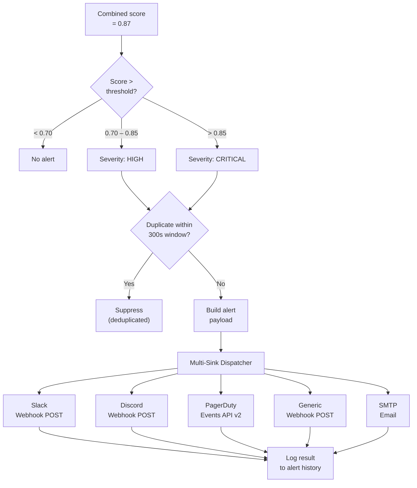
```mermaid
flowchart TB
    SCORE["Combined score<br/>= 0.87"] --> THRESHOLD{"Score ><br/>threshold?"}
    THRESHOLD -->|"< 0.70"| NONE["No alert"]
    THRESHOLD -->|"0.70 – 0.85"| HIGH_ALERT["Severity: HIGH"]
    THRESHOLD -->|"> 0.85"| CRIT_ALERT["Severity: CRITICAL"]

    HIGH_ALERT & CRIT_ALERT --> DEDUP{"Duplicate within<br/>300s window?"}
    DEDUP -->|Yes| SUPPRESS["Suppress<br/>(deduplicated)"]
    DEDUP -->|No| BUILD["Build alert<br/>payload"]

    BUILD --> DISPATCH["Multi-Sink Dispatcher"]

    DISPATCH --> SLACK["Slack<br/>Webhook POST"]
    DISPATCH --> DISCORD["Discord<br/>Webhook POST"]
    DISPATCH --> PAGER["PagerDuty<br/>Events API v2"]
    DISPATCH --> WEBHOOK["Generic<br/>Webhook POST"]
    DISPATCH --> EMAIL["SMTP<br/>Email"]

    SLACK & DISCORD & PAGER & WEBHOOK & EMAIL --> LOG["Log result<br/>to alert history"]
```

### Alert Payload

```json
{
  "system": "Project Velure",
  "severity": "CRITICAL",
  "timestamp": "2026-04-18T10:43:06Z",
  "combined_score": 0.87,
  "ciss_score": 1.0,
  "top_anomaly_model": "CISS",
  "merton_worst": {"ticker": "MS", "dd": 1.44, "pd": 0.0748},
  "regime": "EXTREME",
  "message": "Systemic stress CRITICAL — CISS=100.0%, Combined=87.2%"
}
```

---

## Fault Tolerance & Resilience

### Circuit Breaker Pattern

```mermaid
stateDiagram-v2
    [*] --> CLOSED
    CLOSED --> OPEN : failure_count >= threshold
    OPEN --> HALF_OPEN : recovery_timeout elapsed
    HALF_OPEN --> CLOSED : probe succeeds
    HALF_OPEN --> OPEN : probe fails

    CLOSED : All requests pass through
    CLOSED : Track failure count
    OPEN : All requests fail fast
    OPEN : Return fallback value
    HALF_OPEN : Allow single probe request
    HALF_OPEN : Decide OPEN or CLOSED
```

**Applied to:**
- Finnhub WebSocket reconnection
- PostgreSQL write operations
- Redis stream operations
- External alert webhook delivery

### Graceful Degradation

```mermaid
flowchart TB
    subgraph FULL["Full Stack (Production)"]
        R_ON["Redis Streams ✅"]
        PG_ON["PostgreSQL ✅"]
        FH_ON["Finnhub ✅"]
        ALL_ON["All features<br/>operational"]
    end

    subgraph PARTIAL["Partial (Dev / Hackathon)"]
        R_OFF["Redis ❌ → asyncio.Queue"]
        PG_OFF["PostgreSQL ❌ → no persistence"]
        FH_OFF["Finnhub ❌ → simulator"]
        MOST_ON["Core pipeline +<br/>all ML models work"]
    end

    subgraph MINIMAL["Minimal (Zero Dependencies)"]
        JUST_PY["Python + pip only"]
        SIM_ONLY["Simulator mode"]
        NO_PERSIST["No persistence"]
        STILL_WORKS["Full ML pipeline +<br/>WebSocket dashboard<br/>still works ✅"]
    end
```

The system is designed to run with **zero external dependencies** — no Redis, no PostgreSQL, no API keys. The simulator, ML models, WebSocket broadcasting, and frontend all function independently.

---

## Deployment Architecture

### Docker Compose (Default)

```mermaid
flowchart TB
    subgraph DOCKER["Docker Compose Network"]
        subgraph REDIS_C["redis:7-alpine"]
            REDIS_S["Port 6379<br/>256MB maxmem<br/>allkeys-lru"]
        end

        subgraph PG_C["postgres:16-alpine"]
            PG_S["Port 5432<br/>Star schema<br/>Auto-seeded"]
        end

        subgraph BACK_C["backend (Python 3.12)"]
            BACK_S["Port 8000<br/>uvicorn<br/>36 routes"]
        end

        subgraph FRONT_C["frontend (Node 20)"]
            FRONT_S["Port 3000<br/>Next.js 16<br/>SSR"]
        end
    end

    REDIS_S -->|healthcheck| BACK_S
    PG_S -->|healthcheck| BACK_S
    BACK_S -->|healthcheck| FRONT_S

    USER["Browser"] --> FRONT_S
    FRONT_S -->|WebSocket + REST| BACK_S
```

### Service Dependencies

```mermaid
flowchart LR
    REDIS["Redis"] -->|healthy| BACKEND
    POSTGRES["PostgreSQL"] -->|healthy| BACKEND
    BACKEND -->|healthy| FRONTEND
    FRONTEND -->|ready| USER["User Browser"]
```

---

## Performance Characteristics

### Throughput & Latency

| Metric | Value | Measured |
|--------|-------|---------|
| Max tick rate | 25 Hz | Turbo mode stable |
| Micro-batch inference | ~80ms | 10 ticks through 6 models |
| WebSocket broadcast | ~2ms | Per connected client |
| REST API (GET) | 1–5ms | All endpoints |
| REST API (POST stress-test) | ~14ms | Including crisis state update |
| Frontend RAF flush | 16.6ms | Capped at 60fps |
| Model warm-up (cold start) | ~2s | All 6 models auto-train |
| Model checkpoint save | ~100ms | Atomic write to disk |
| End-to-end latency | ~150ms | Tick arrival → pixel update |

### Memory Profile

| Component | Memory | Notes |
|-----------|--------|-------|
| Isolation Forest | ~15 MB | 200 trees + scaler |
| LSTM Autoencoder | ~8 MB | PyTorch CPU model |
| CISS Scorer | ~2 MB | 5 segment buffers (500 each) |
| Merton Model | ~1 MB | 5 bank price/vol buffers |
| t-Copula + GARCH | ~3 MB | Correlation matrix + residuals |
| VaR Calculator | ~2 MB | Rolling return windows |
| Redis buffer | ~5 MB | 10K stream entries |
| **Total backend** | **~50 MB** | Under normal operation |

### Request Rates

```
Tick Rate:    4 Hz (default) → 14,400 ticks/hour
Inference:    ~8 batches/sec (10 ticks each)
WebSocket:    ~8 broadcasts/sec per client
REST polls:   ~0.5 req/sec (SystemMetrics component)
DB writes:    ~8 INSERTs/sec (when PostgreSQL connected)
```

---

*Project Velure · System Architecture · v3 Production Track*
*DevClash 2026 · Team Syntax Cartel*
