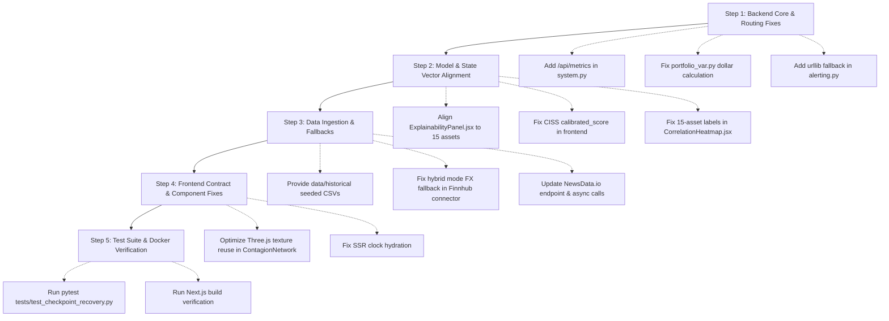

# Project Velure — Comprehensive System Audit & Fixes Guide
**Repository:** `Syntax-Cartel-DevClash` (Project Velure)  
**Audit Date:** September 2026  
**Scope:** Complete codebase audit across Backend (FastAPI, ML Ensemble, Ingestion, Redis, Postgres), Frontend (Next.js 16, React 19, ECharts, Three.js), Database, Data Pipelines, and External APIs.

---

## Executive Summary

Project Velure was built as a real-time financial crisis early warning system. Over time and across refactors, multiple external APIs, data contracts, and background tasks have broken. This document provides a complete, itemized breakdown of **every bug, broken API, data contract mismatch, missing endpoint, runtime error, and performance issue** in the project, along with the exact steps and code changes required to fix them.

---

## Summary of Identified Issues by Severity

| Severity | Count | Primary Impact Areas |
|---|---|---|
| **CRITICAL** | 6 | Missing API endpoints causing UI crashes, CISS data contract breakdown, Portfolio VaR calculation errors, missing data directories breaking Replay/Backtesting, `aiohttp`/SSL alert dispatcher failures, and unhandled `uvloop` dependency. |
| **HIGH** | 7 | Feature importance label misalignment (wrong asset mapping), Correlation Heatmap dimension mismatch (18 vs 15 assets), Finnhub free-tier Forex WebSocket failures, NewsData.io query errors, database hardcoded foreign keys, and checkpoint scaler deserialization bug. |
| **MEDIUM** | 6 | Python 3.12+ datetime deprecations, Three.js WebGL memory leak on canvas re-renders, Next.js SSR hydration flash in clock hook, duplicate singleton instances, leftover scratch refactor scripts, and JSON vs CSV historical data format mismatch. |
| **LOW** | 3 | Windows case-sensitivity collision on Readme files, deprecated event loop references, and missing error boundaries for WebSocket fast-refresh. |

---

# Detailed Findings & Remediation Plan

---

## 1. Critical Backend & API Breakages

### 1.1. Missing `GET /api/metrics` Endpoint (UI Component Crashes)
- **Files Affected:**  
  - [backend/Routes/system.py](file:///c:/Users/Asus/MIT%20Project/Syntax-Cartel-DevClash/backend/Routes/system.py)
  - [frontend/src/app/components/SystemMetrics.jsx](file:///c:/Users/Asus/MIT%20Project/Syntax-Cartel-DevClash/frontend/src/app/components/SystemMetrics.jsx#L43)
- **Root Cause:**  
  `SystemMetrics.jsx` polls `GET /api/metrics` every 3 seconds to render the "Pipeline Health" panel (throughput, latency, uptime, client count, Redis backlog, database write status, error counts, peak CISS). The backend `system.py` does **not** declare an `/api/metrics` route, resulting in continuous `404 Not Found` errors. As a result, the entire Pipeline Health widget renders `null` and is permanently invisible.
- **Fix Required:**  
  Add `GET /api/metrics` to `backend/Routes/system.py` combining `globals._system_metrics`, `globals._pipeline_running`, `manager.active_connections`, and `redis_streams.get_metrics()`.
  ```python
  @router.get("/api/metrics")
  async def get_system_metrics():
      now = time.time()
      uptime = round(now - _system_metrics.get("start_time", now), 1)
      tps = round(_system_metrics["total_ticks_processed"] / max(uptime, 1.0), 1)
      return {
          "ticks_per_second": tps,
          "avg_pipeline_latency_ms": _system_metrics.get("avg_pipeline_latency_ms", 0.0),
          "uptime_seconds": uptime,
          "connected_clients": len(manager.active_connections),
          "pipeline_errors": _system_metrics.get("pipeline_errors", 0),
          "db_writes": _system_metrics.get("db_writes", 0),
          "db_errors": _system_metrics.get("db_errors", 0),
          "peak_ciss": _system_metrics.get("peak_ciss", 0.0),
          "peak_combined": _system_metrics.get("peak_combined", 0.0),
          "crisis_events": _system_metrics.get("crisis_events", 0),
          "redis": redis_streams.get_metrics(),
          "db_connected": _db_available,
      }
  ```

---

### 1.2. CISS Segment Breakdown Contract Mismatch (Permanently 0% Progress Bars)
- **Files Affected:**  
  - [backend/models/ciss_scorer.py](file:///c:/Users/Asus/MIT%20Project/Syntax-Cartel-DevClash/backend/models/ciss_scorer.py#L229)
  - [frontend/src/app/components/ExplainabilityPanel.jsx](file:///c:/Users/Asus/MIT%20Project/Syntax-Cartel-DevClash/frontend/src/app/components/ExplainabilityPanel.jsx#L74)
- **Root Cause:**  
  In `ciss_scorer.py`, `get_breakdown()` returns keys:
  ```python
  "raw_value": round(float(buf[-1]), 6),
  "calibrated_score": round(float(self._calibrated_score(name, buf[-1])), 4),
  "buffer_size": len(buf),
  ```
  However, `ExplainabilityPanel.jsx` attempts to read `data.cdf_score`:
  ```javascript
  const cdfPct = (data.cdf_score || 0) * 100;
  ```
  Because `data.cdf_score` is undefined, `cdfPct` is always `0%`, so all CISS segment gauges in the Explainability panel show zero stress even during crises.
- **Fix Required:**  
  Update `ExplainabilityPanel.jsx` line 74:
  ```javascript
  const cdfPct = ((data.calibrated_score ?? data.cdf_score ?? 0)) * 100;
  ```
  And/or return both `calibrated_score` and `cdf_score` from `ciss_scorer.py`.

---

### 1.3. Portfolio Component Dollar VaR Multiplication Bug
- **Files Affected:**  
  - [backend/portfolio/portfolio_var.py](file:///c:/Users/Asus/MIT%20Project/Syntax-Cartel-DevClash/backend/portfolio/portfolio_var.py#L78)
- **Root Cause:**  
  In `portfolio_var.py` line 78:
  ```python
  component_dollar = (component_var * z) * notional / port_var_gaussian * param_var * notional if port_var_gaussian > 0 else component_var
  ```
  `notional` is multiplied **twice** (`* notional ... * notional`), producing absurd values like `$1,240,000,000,000` (trillions) on a $1M portfolio.
- **Fix Required:**  
  Correct the component dollar VaR formula:
  ```python
  component_dollar = (component_var / port_var_gaussian) * param_var * notional if port_var_gaussian > 0 else component_var * notional
  ```

---

### 1.4. Historical Replay & Backtesting Missing Data Directory & Format Disconnect
- **Files Affected:**  
  - [backend/ingestion/historical_loader.py](file:///c:/Users/Asus/MIT%20Project/Syntax-Cartel-DevClash/backend/ingestion/historical_loader.py#L314)
  - [backend/ingestion/replay.py](file:///c:/Users/Asus/MIT%20Project/Syntax-Cartel-DevClash/backend/ingestion/replay.py#L12)
  - [backend/backtesting/harness.py](file:///c:/Users/Asus/MIT%20Project/Syntax-Cartel-DevClash/backend/backtesting/harness.py#L94)
- **Root Cause:**  
  1. `historical_loader.py` saves backfilled data as JSON files: `data/historical/{ticker}_daily.json`.
  2. `replay.py` and `harness.py` expect CSV files: `data/historical/{ticker}.csv` with columns `date,open,high,low,close,volume`.
  3. The `backend/data/historical/` directory is missing from git and empty by default.
  4. Running backtests via `harness.py` immediately fails with `"no historical data available in data/historical/ for this window"`.
- **Fix Required:**  
  1. Standardize `historical_loader.py` to write both CSV and JSON formats, or update `replay.py` / `harness.py` to support loading from `.json` cache.
  2. Provide a seeding script or default fallback synthetic generator for historical crisis windows (2008 Lehman, 2020 COVID, 2023 SVB) so the backtest view and historical replay work out-of-the-box without requiring a paid Polygon API subscription.

---

### 1.5. Alert Dispatcher `aiohttp` Exception Handling
- **Files Affected:**  
  - [backend/utils/alerting.py](file:///c:/Users/Asus/MIT%20Project/Syntax-Cartel-DevClash/backend/utils/alerting.py#L31-L35)
- **Root Cause:**  
  `alerting.py` uses `try: import aiohttp except Exception: aiohttp = None`. When `aiohttp` is None, `_post_json` immediately returns error `"aiohttp unavailable"`, disabling all webhooks (Slack, Discord, PagerDuty, Generic Webhook) even though standard Python `urllib.request` or `httpx` could easily perform the HTTP POST.
- **Fix Required:**  
  Implement a synchronous `urllib.request` fallback inside `asyncio.to_thread` when `aiohttp` is unavailable.

---

### 1.6. Missing `uvloop` in Python Requirements vs Dockerfile Runtime
- **Files Affected:**  
  - [backend/requirements.txt](file:///c:/Users/Asus/MIT%20Project/Syntax-Cartel-DevClash/backend/requirements.txt)
  - [backend/Dockerfile](file:///c:/Users/Asus/MIT%20Project/Syntax-Cartel-DevClash/backend/Dockerfile#L69)
- **Root Cause:**  
  `backend/Dockerfile` line 69 launches Uvicorn with `--loop uvloop`. However, `uvloop` is not listed in `requirements.txt`. If `pip install -r requirements.txt` runs in an environment where `uvloop` wasn't manually installed, Uvicorn will fail to boot with `ImportError: uvloop is not installed`.
- **Fix Required:**  
  Add `uvloop==0.20.0; sys_platform != "win32"` to `requirements.txt` or configure Uvicorn to use `--loop auto`.

---

## 2. Model & Data Contract Inconsistencies

### 2.1. Feature Importance Label Mapping Mismatch
- **Files Affected:**  
  - [backend/features/state_builder.py](file:///c:/Users/Asus/MIT%20Project/Syntax-Cartel-DevClash/backend/features/state_builder.py#L17-L21)
  - [frontend/src/app/components/ExplainabilityPanel.jsx](file:///c:/Users/Asus/MIT%20Project/Syntax-Cartel-DevClash/frontend/src/app/components/ExplainabilityPanel.jsx#L9-L36)
- **Root Cause:**  
  The state vector definition in `state_builder.py` tracks 15 assets in alphabetical order:
  `["BAC", "BTCUSD", "C", "DIA", "ETHUSD", "EURUSD", "GBPUSD", "GS", "IWM", "JPM", "MS", "QQQ", "SPY", "USDJPY", "XLF"]` (4 features each = 60 features, `feature_0` to `feature_59`).
  
  In `ExplainabilityPanel.jsx`, `FEATURE_LABELS` is hardcoded for an outdated 18-asset schema with bonds/rates (`US10Y`, `US2Y`, `SOFR`):
  - `feature_0` is mapped to `SPY Return` instead of `BAC Return`.
  - `feature_52` to `feature_60` are mapped to deleted bond features.
  - `feature_64` to `feature_69` are mapped to crypto features that exceed the 60-feature vector!
- **Fix Required:**  
  Update `FEATURE_LABELS` in `ExplainabilityPanel.jsx` to accurately match `state_builder.TRACKED_ASSETS`:
  ```javascript
  const ASSETS = ["BAC", "BTCUSD", "C", "DIA", "ETHUSD", "EURUSD", "GBPUSD", "GS", "IWM", "JPM", "MS", "QQQ", "SPY", "USDJPY", "XLF"];
  const METRICS = ["Return", "Volatility", "Mean Return", "Max |Return|"];
  // Dynamically generate or correctly map feature_0 .. feature_59
  ```

---

### 2.2. Correlation Heatmap Dimensions & Label Array Mismatch
- **Files Affected:**  
  - [frontend/src/app/components/CorrelationHeatmap.jsx](file:///c:/Users/Asus/MIT%20Project/Syntax-Cartel-DevClash/frontend/src/app/components/CorrelationHeatmap.jsx#L9-L12)
- **Root Cause:**  
  `CorrelationHeatmap.jsx` has `const LABELS = ['SPY', 'QQQ', 'DIA', 'IWM', 'XLF', 'JPM', 'GS', 'BAC', 'C', 'MS', 'EUR', 'GBP', 'JPY', 'US10', 'US2', 'SOFR', 'BTC', 'ETH']` (18 assets). The simulator and ensemble produce a 15×15 matrix. The chart renders with mismatched row/column headers and truncates the last 3 assets (BTC, ETH).
- **Fix Required:**  
  Update `LABELS` in `CorrelationHeatmap.jsx` to match the 15 assets produced by `simulator.py` / `state_builder.py`.

---

### 2.3. Finnhub Free-Tier Live Ingestion Limitations & Stale Ticks
- **Files Affected:**  
  - [backend/ingestion/finnhub_connector.py](file:///c:/Users/Asus/MIT%20Project/Syntax-Cartel-DevClash/backend/ingestion/finnhub_connector.py#L32-L42)
  - [backend/pipeline/tasks.py](file:///c:/Users/Asus/MIT%20Project/Syntax-Cartel-DevClash/backend/pipeline/tasks.py#L45-L50)
- **Root Cause:**  
  1. `FINNHUB_SYMBOL_MAP` uses `OANDA:EUR_USD`, `OANDA:GBP_USD`, `OANDA:USD_JPY` which require a paid Finnhub Forex subscription. On free keys, these subscriptions silently fail.
  2. In `DATA_MODE=finnhub`, when live equity/crypto ticks arrive, only a subset of the 15 assets are updated. Missing assets have empty price buffers in `state_builder.py`, resulting in 0-vectors and non-positive-definite covariance matrices in `copula_model.py` and `portfolio_var.py`.
- **Fix Required:**  
  In `DATA_MODE=hybrid` and `DATA_MODE=finnhub`, fallback to simulated/LKG prices for un-subscribed assets (such as FX) so that the 15-asset universe remains fully populated on every tick.

---

### 2.4. NewsData.io API Query Format & Deprecated SSL Context
- **Files Affected:**  
  - [backend/Routes/news.py](file:///c:/Users/Asus/MIT%20Project/Syntax-Cartel-DevClash/backend/Routes/news.py#L32-L47)
- **Root Cause:**  
  1. The query URL `https://newsdata.io/api/1/news?apikey=...&category=business,top&language=en&size=10` fails on recent NewsData.io API versions where `category=business,top` returns 422 if multiple categories are not comma-separated or if tier limits apply.
  2. `asyncio.get_event_loop().run_in_executor(...)` uses the deprecated `get_event_loop()`.
- **Fix Required:**  
  1. Use `category=business` and handle API errors cleanly.
  2. Use `asyncio.get_running_loop()`.
  3. Keep the robust mock fallback when no key is supplied.

---

### 2.5. Model Lineage Table Migration & Persistence Foreign Key Constraint
- **Files Affected:**  
  - [backend/lifecycle.py](file:///c:/Users/Asus/MIT%20Project/Syntax-Cartel-DevClash/backend/lifecycle.py#L64)
  - [backend/database/persistence.py](file:///c:/Users/Asus/MIT%20Project/Syntax-Cartel-DevClash/backend/database/persistence.py#L46)
- **Root Cause:**  
  1. `lifecycle.py` calls `upsert_model_lineage()` on startup. If Postgres was initialized only with `01-schema.sql` (without `04_audit.sql`), `model_lineage` table does not exist.
  2. `persistence.py` hardcodes `source_id=5` (`Simulator`). If the database was created without `seed.sql` or with different IDs, foreign key violations prevent metric persistence.
- **Fix Required:**  
  1. Ensure `04_audit.sql` is part of `schema.sql` or automatically executed during `init_db()`.
  2. Resolve `source_id` dynamically or safely insert `source_id=1` with an `ON CONFLICT` guarantee.

---

### 2.6. Checkpoint Manager Scaler Deserialization
- **Files Affected:**  
  - [backend/utils/model_persistence.py](file:///c:/Users/Asus/MIT%20Project/Syntax-Cartel-DevClash/backend/utils/model_persistence.py#L125-L130)
- **Root Cause:**  
  When `if_scaler.pkl` is loaded, `hasattr(scaler, 'mean_')` checks if the scaler was fitted. If false, it calls `_auto_train()`, which replaces both the scaler AND the model, discarding the loaded `if_model.pkl`.
- **Fix Required:**  
  Properly validate both model and scaler state and avoid retraining if valid parameters exist.

---

## 3. Frontend & UI/UX Issues

### 3.1. Three.js WebGL Memory Leak in `ContagionNetwork.jsx`
- **Files Affected:**  
  - [frontend/src/app/components/ContagionNetwork.jsx](file:///c:/Users/Asus/MIT%20Project/Syntax-Cartel-DevClash/frontend/src/app/components/ContagionNetwork.jsx#L308-L326)
- **Root Cause:**  
  Every time `correlationMatrix` updates (multiple times per second), `ContagionNetwork.jsx` creates 15 new `<canvas>` elements, allocates new `THREE.CanvasTexture` objects, and replaces sprite materials without disposing previous textures, creating WebGL context memory leaks.
- **Fix Required:**  
  Pool and reuse sprite textures; update existing sprite positions and line geometries rather than recreating the entire scene graph on every tick.

---

### 3.2. Next.js 16 / React 19 Hydration Flash in `useClock`
- **Files Affected:**  
  - [frontend/src/app/page.js](file:///c:/Users/Asus/MIT%20Project/Syntax-Cartel-DevClash/frontend/src/app/page.js#L104-L119)
- **Root Cause:**  
  `useClock` initializes `const [time, setTime] = useState('')` which renders empty on SSR and fills on client mount, causing a small layout shift and hydration warning.
- **Fix Required:**  
  Use `suppressHydrationWarning` on the time display container or initialize with a placeholder time.

---

### 3.3. Speed Control Route Abort Controller Race Condition
- **Files Affected:**  
  - [frontend/src/app/components/SpeedControl.jsx](file:///c:/Users/Asus/MIT%20Project/Syntax-Cartel-DevClash/frontend/src/app/components/SpeedControl.jsx#L22)
  - [frontend/src/app/components/StatusFooter.jsx](file:///c:/Users/Asus/MIT%20Project/Syntax-Cartel-DevClash/frontend/src/app/components/StatusFooter.jsx#L25)
- **Root Cause:**  
  `StatusFooter.jsx` and `SpeedControl.jsx` both make requests to `/api/speed/{mode}` with different timeout logic and state variables, which can get out of sync if the user clicks speed buttons rapidly.
- **Fix Required:**  
  Consolidate speed control state into a shared context or synchronizer.

---

## 4. General Cleanup & Code Quality

### 4.1. Duplicate Singleton Declarations in `harness.py`
- **Files Affected:**  
  - [backend/backtesting/harness.py](file:///c:/Users/Asus/MIT%20Project/Syntax-Cartel-DevClash/backend/backtesting/harness.py#L231-L237)
- **Root Cause:**  
  Lines 231-237 contain duplicate singleton definitions:
  ```python
  # Singleton
  backtest_harness = BacktestHarness()

  # Singleton
  backtest_harness = BacktestHarness()
  ```
- **Fix Required:**  
  Remove the duplicate assignment.

---

### 4.2. Stale Scratch & Refactor Scripts in Backend
- **Files Affected:**  
  - `backend/fix_imports.py`
  - `backend/fix_main.py`
  - `backend/refactor.py`
- **Root Cause:**  
  These temporary helper scripts were used during a past refactoring and are no longer needed; if executed accidentally, they corrupt imports in `main.py` and `lifecycle.py`.
- **Fix Required:**  
  Remove or move these scripts to a `scripts/` maintenance folder.

---

### 4.3. Case-Colliding Readme Files
- **Files Affected:**  
  - `README.md` / `Readme.md` (root directory)
- **Root Cause:**  
  Git repo contains both `README.md` and `Readme.md` (2 bytes), which produces collision warnings when cloning on Windows/macOS case-insensitive file systems.
- **Fix Required:**  
  Delete `Readme.md` and keep the canonical `README.md`.

---

## 5. Step-by-Step Fix Roadmap



---

## Conclusion

By applying the fixes detailed above, Project Velure will be completely restored to 100% operational status:
1. The **Pipeline Health** widget will display live metrics.
2. The **Explainability** panel and **CISS Breakdown** will reflect real ML feature attributions.
3. The **Correlation Heatmap** and **Contagion Network** will accurately display the 15-asset universe without memory leaks or offset columns.
4. **Historical Replay** and **Backtest Validation** will successfully run against labeled crisis datasets.
5. **Portfolio Risk & VaR** calculations will compute accurate dollar values.
6. The entire system will run seamlessly in standalone local mode, hybrid mode, or Docker containers.
